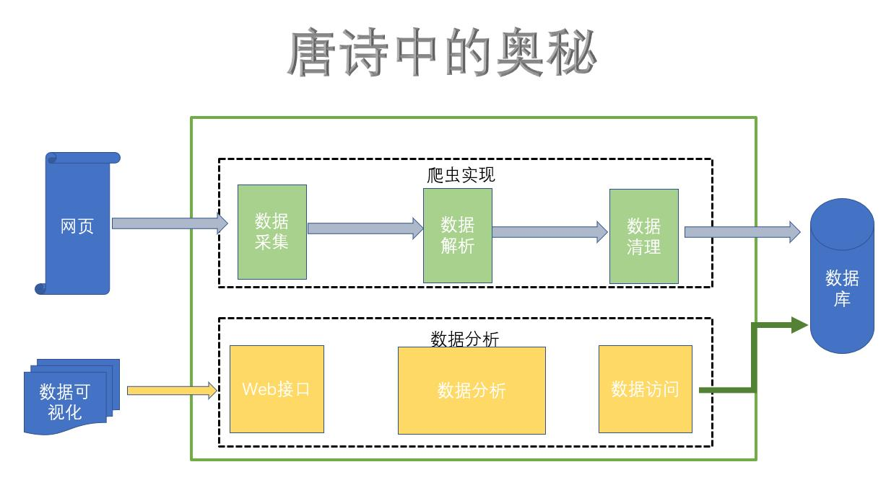

## 项目名称
诗的奥秘
## 项目背景
&nbsp;&nbsp;&nbsp;&nbsp;从小到大读过很多唐诗，甚至在我们根本不能理解诗的含义的情况下我们也背过诗，我们背过抒情的、励志的、思乡的等等，那么在古代大多数诗人擅长用的词语是什么?是代表思乡的明月、还是抒情的词语还是对官场厌恶。而在古代谁又作诗最多呢？到底是我们耳熟能详的李白还是杜甫或者说另有其人？
&nbsp;&nbsp;&nbsp;&nbsp;诗的奥秘程序主要是通过抓取互联网上的唐诗（互联网上的数据不是我们的，所以对我们来讲特别的混乱，必须进行处理），然后进行数据的清洗、解析、存储、数据分析最终得出我们想要的答案。
## 项目功能
 - 数据采集、清洗、存储 
 - 数据分析、可视化展示
## 项目框架

## 爬虫部分代码
crawler包:主要的功能是采集、解析、清洗
+ 采集 HtmlUnit
我们主要是想将源码拿到我们本地，相当于复制粘贴的操作，但是我们不可能将所有的页面都复制粘贴到本地，
所有其实我们只需要来模拟浏览器的请求(根据浏览器的地址获取内容)来请求数据即可,这个过程我们就叫做采集
+ HTML文档解析
请求之后,我们只是获得了一大堆的源码(HTML源码)也就是字符串，我们必须解析字符串来获取我们想要的内容
比如说拿下来textarea这个标签
+ 清洗
解析完成之后又拿到了一小段的片段，之后我们想要对这一段内容进行分门别类(比如作者、朝代、内容)
清洗完成之后我们就可以得到很清楚的一些信息、这些清除的信息我们就可以放到数据库中

采集网页特别多我们需要多线程调度
页面分为详情页、标题页(超链接，我们需要进入超链接中进行解析内容页)
异步处理:生产者消费者模型
调度器专门来分配任务
+ 采集-生产者 解析-消费者
+ 解析-生产者 清洗-消费者
## 项目效果

## 项目测试