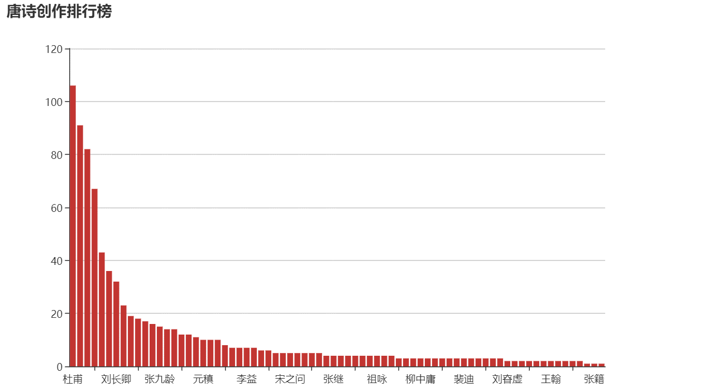
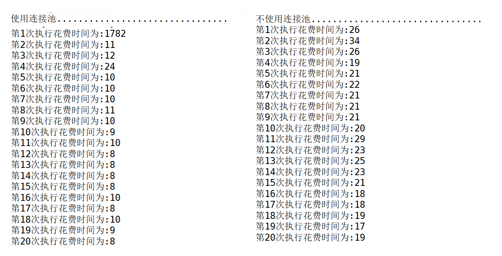
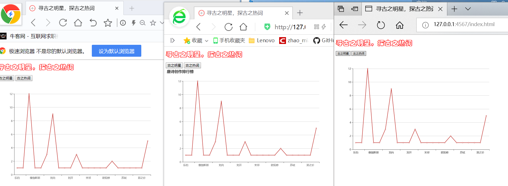

## 项目名称
寻古之明星，探古之热词
## 项目背景
&nbsp;&nbsp;&nbsp;&nbsp;从小到大读过很多唐诗，甚至在我们根本不能理解诗的含义的情况下我们也背过诗，我们背过抒情的、励志的、思乡的等等，那么在古代大多数诗人擅长用的词语是什么?是代表思乡的明月、还是抒情的词语还是对官场厌恶。而在古代谁又作诗最多呢？到底是我们耳熟能详的李白还是杜甫或者说另有其人？
&nbsp;&nbsp;&nbsp;&nbsp;《寻古之明星，探古之热词》程序主要是通过抓取互联网上的唐诗（互联网上的数据不是我们的，所以对我们来讲特别的混乱，必须进行处理），然后进行数据的清洗、解析、存储、数据分析最终得出我们想要的答案。
## 项目功能
 - 采集网页内容，利用htmlunit工具进行数据解析之后存入MySQL数据库中
 - 通过分析数据得出诗人与创作数量的对应关系
 - 利用ansj中文分词技术分析出古文中热度较高的词
## 项目效果
这是仅展示部分

## 项目测试
- 功能测试采用黑盒测试和白盒测试相结合
- 通过代码对数据库连接池的特性进行测试

- 多个浏览器进行兼容性测试

## 项目详情
更多项目详情，请点击:https://blog.csdn.net/zhao_miao/article/details/96735745